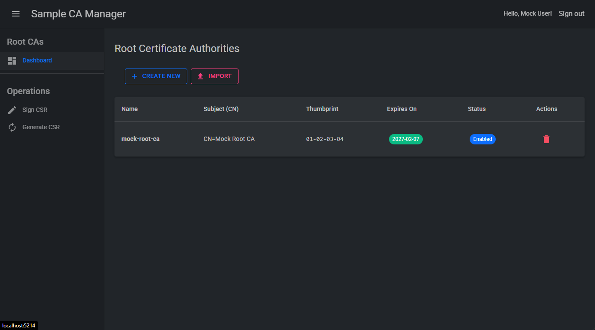
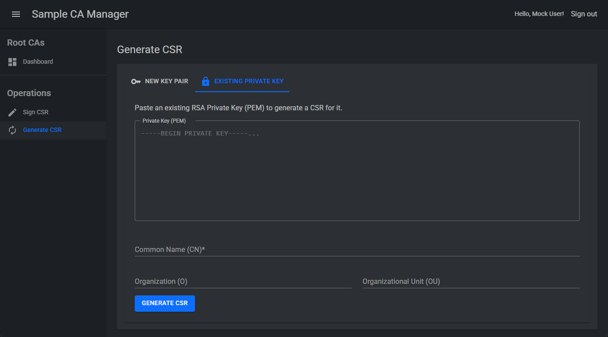
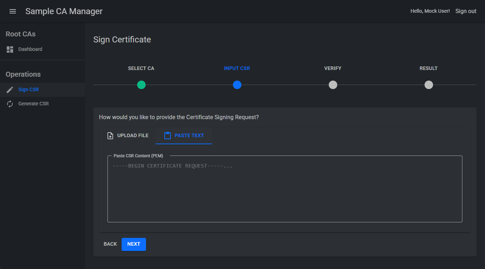

# Azure Key Vault CA Manager

[](https://github.com/celloza/azure-keyvault-ca-portal/actions/workflows/deploy.yml)

A lightweight, secure ASP.NET Core 8 Blazor Server application for managing Azure Key Vault Certificates and performing remote CSR signing. This project allows you to operate a private Certificate Authority (CA) backed by the hardware security of Azure Key Vault.



## Features

- **Root CA Management**: Create, Import, and Delete Root CAs directly within Azure Key Vault.
- **CSR Generation**: Generate new RSA Key Pairs (2048/4096-bit) and CSRs, or create a CSR for an existing private key.
    
- **CSR Inspection & Signing**: Upload and inspect Certificate Signing Requests (CSRs) before signing.
    
- **Remote Signing**: Sign CSRs using keys stored in Azure Key Vault without the private key ever leaving the vault.
- **Secure Infrastructure**: 
  - Fully integrated with Azure Managed Identity.
  - VNet Integration for App Service.
  - Private Endpoints for Key Vault and Storage.
  - RBAC-based access control.

## Architecture

- **Frontend/API**: ASP.NET Core 8 Blazor Server App.
- **Identity**: Microsoft Entra ID (stats-less authentication).
- **Storage**: Azure Key Vault (Keys/Certs) & Azure Blob Storage (Data Protection/Infrastructure).
- **Infrastructure**: Terraform-managed Azure resources.

### Authentication (Entra ID)

The application uses **Microsoft Entra ID** (formerly Azure AD) for user authentication. You must register an application in your Entra ID tenant.

1.  **Create App Registration**:
    -   Go to Entra ID > App Registrations > New Registration.
    -   Name: `CaManager` (or similar).
    -   Supported Account Types: Single Tenant (usually).
    -   Redirect URI (Web): `https://<your-app-url>/signin-oidc` (e.g., `https://localhost:7193/signin-oidc` for local dev).

2.  **Configure `appsettings.json`**:
    Update the `AzureAd` section with your tenant details:
    ```json
    "AzureAd": {
      "Instance": "https://login.microsoftonline.com/",
      "Domain": "your-tenant.onmicrosoft.com",
      "TenantId": "your-tenant-id-guid",
      "ClientId": "your-client-id-guid",
      "CallbackPath": "/signin-oidc"
    }
    ```

## Prerequisites

- Azure Subscription
- Azure CLI
- Terraform
- .NET 8 SDK

## Getting Started

### 1. Infrastructure Deployment

This project uses Terraform to provision all necessary Azure resources.

```bash
cd infra
terraform init
terraform apply -var="resource_group_name=my-rg" -var="location=UK South"
```

> **Note**: This will output the `app_service_name` and configure your Key Vault with Private Endpoints.

### 2. Local Development

1.  Add your user to the "Key Vault Administrator" role on the deployed Key Vault.
2.  Update `appsettings.json` (or use User Secrets) with your `AzureAd` config and `KeyVault:Url`.
3.  Run the application:
    ```bash
    dotnet run
    ```

## Deployment Model

The App Service is configured with `WEBSITE_RUN_FROM_PACKAGE` pointing to the GitHub Release URL of this repository.

### Default Behavior
by default, the Terraform configuration pulls the `latest.zip` artifact from the **latest** release of this repository.

> [!WARNING]
> This means your deployment will automatically pick up the latest changes when the App Service restarts. If the maintainer releases a breaking change, your environment may break.

### Recommendation for Production
To ensure stability, you should **pin your deployment to a specific release version**. 

You can do this by updating the `WEBSITE_RUN_FROM_PACKAGE` setting in `infra/appservice.tf` to point to a specific tag's artifact URL (e.g., `https://github.com/celloza/azure-keyvault-ca-portal/releases/download/v1.0.0/latest.zip`).

### Version Notifications
The application dashboard includes a **Version Check** feature that queries the GitHub API to check for newer releases.
-   If you have **pinned** your version (recommended), this feature will alert you when a new version is available, allowing you to plan your upgrade.
-   If you are using `latest.zip`, the alert may briefly appear before your App Service restarts and pulls the new code (depending on restart timing).

## Network Integration

By default, the deployed App Service is **Private Only**. It is integrated into a Virtual Network and uses Private Endpoints for all backend communication (Key Vault, Storage).

### Integrating into an Existing Environment

The provided Terraform code creates a standalone VNet. To integrate this into your existing environment (e.g., a Hub-Spoke topology with Azure Virtual WAN or an ExpressRoute gateway):

1.  **Peering/Connection**: You must peer the created VNet with your existing network or connect it to your Virtual WAN hub.
2.  **Custom Terraform**: Add a file named `vwan.tf` (or similar) in the `infra/` folder.
    -   This file is **git-ignored** by default to allow for environment-specific customization without polluting the repository.
    -   Use this file to define `azurerm_virtual_hub_connection` or `azurerm_virtual_network_peering` resources linking the new VNet to your infrastructure.

### Public Access

While possible, enabling public access to the App Service (`public_network_access_enabled = true` in `appservice.tf`) is **not recommended** for a Certificate Authority management interface. It dramatically increases the attack surface. Keep the interface private and access it via:
-   Azure VPN Point-to-Site
-   ExpressRoute
-   A Jumpbox/Bastion Host within the network
